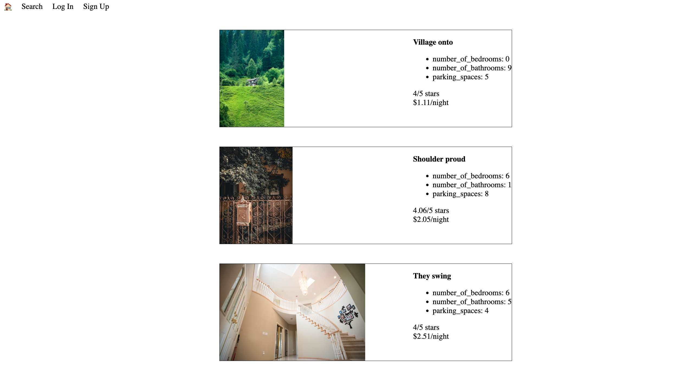
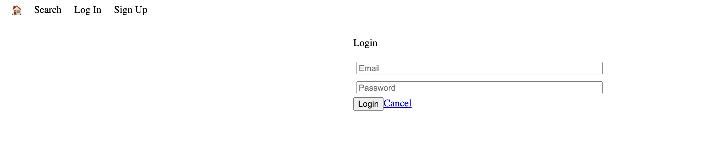
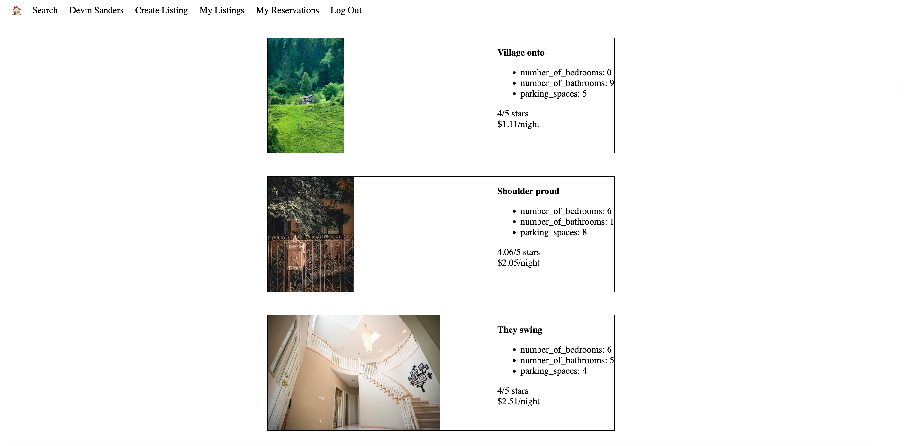

# **LightBnB Project**
> This is a simple multipage Airbnb clone that allows a property owner to let out their properties for rent. Users who are looking to rent can  see the details of the property and create a reservation all on the lighbnb platform. The server side of the application utilises javascript to display queries to web pages via SQL. 

## **Sample Images**

#### **All Properties**

#### **New User Registration**

#### **Existing User Login Page**

#### **Current User's Listed Properties**

## Setup Instructions 
 * To create the tables, run the schema in the **migrations** folder using the code \i migrations/01_schema.sql. 
 * To run a schema file against a database, make sure you are in the correct directory first and that you have a psql session initiated in the directory. 
 * To download sample seed data run wget http://bit.ly/2YNEENF -O seeds/02_seeds.sql on your terminal
 * To seed the file using psql, run \i seeds/02_seeds.sql
 * Install pg 
 * To start the server type **npm run local** on your terminal.