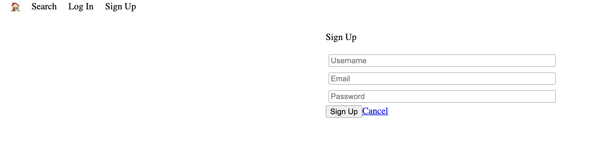

# **LightBnB Project**
> This is a simple multipage Airbnb clone that allows a property owner to let out their properties for rent. Users who are looking to rent can  see the details of the property and create a reservation all on the lighbnb platform. The server side of the application utilises javascript to display queries to web pages via SQL. 

## **Sample Images**

